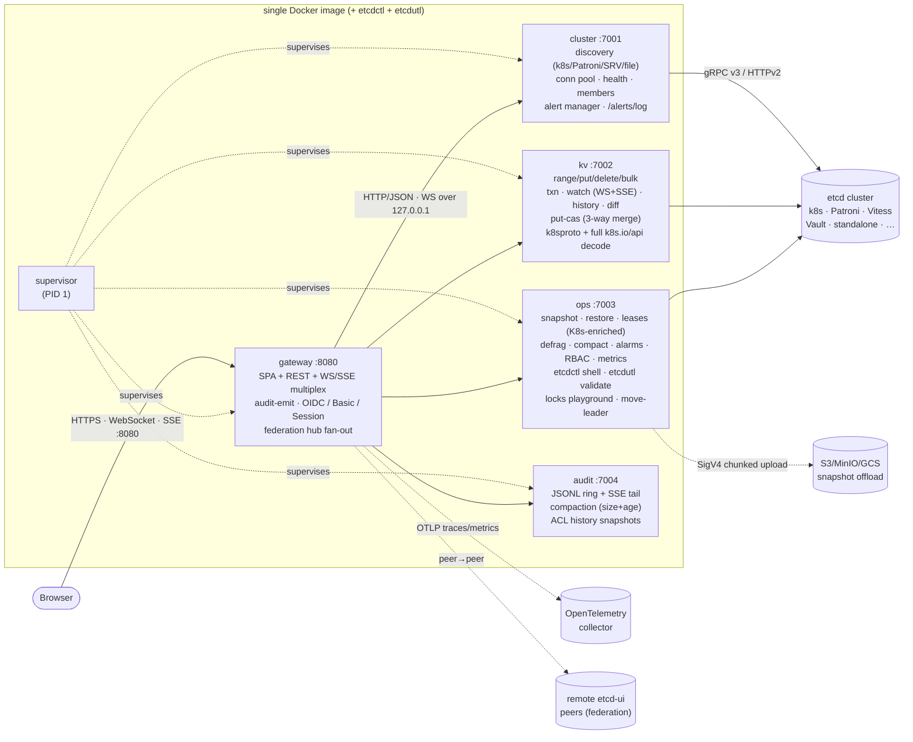

# etcd-ui

> Universal, fast, beautiful UI for any etcd cluster — Kubernetes, Patroni, standalone or DIY. Ships as a single Docker image with a microservice backend.

## Why

Existing etcd UIs are either tied to one platform (`kubectl`, Patroni admin) or look like 2014. This is **one polished UI for any etcd**, regardless of where it lives. Connect once — get cluster health, KV browser, live watch streams, snapshots, lease management, members, alarms, RBAC, audit log and a command palette to do anything in two keystrokes.

## Architecture

Single Docker image, **five Go microservices** behind a tiny supervisor (pid 1). Each owns its concerns and can be split into its own pod tomorrow.



```
ASCII fallback if Mermaid isn't rendered:

   ┌──────────┐   pid 1 — restarts crashed services
   │supervisor│
   └────┬─────┘
        ▼
   ┌─────────┐   :8080  HTTPS + WebSocket + SSE + static SPA
   │ gateway │◀── browser     (only port exposed; WS preferred, SSE fallback)
   └────┬────┘
        │ HTTP/JSON · WS over 127.0.0.1
        ├──────────────┬───────────────────┬──────────────┐
        ▼              ▼                   ▼              ▼
     cluster:7001  kv:7002             ops:7003       audit:7004
     discovery     range/put/delete    snapshot/restore  JSONL ring
     pool, health  bulk, txn, watch    leases (k8s)      SSE tail
     /alerts/log   put-cas (CRDT)      compact/defrag    ACL history
                   k8s.io/api decode   locks, move-leader
                   history, diff       etcdctl, etcdutl
                       │
                       ▼
              etcd cluster(s)   gRPC v3 — auto-detected vs v2

   gateway → S3/MinIO/GCS (snapshot offload, SigV4 chunked)
   gateway ⇄ remote etcd-ui peers (federation hub mode)
   gateway → OpenTelemetry collector (OTLP traces + metrics)
```

### Services

| Service     | Port  | Responsibility                                                                |
| ----------- | ----- | ----------------------------------------------------------------------------- |
| `supervisor`| —     | Boots & supervises the others; PID 1; forwards signals; restart on crash      |
| `gateway`   | 8080  | SPA + REST + WS/SSE multiplex; fans out to internals; emits audit events; OIDC/Basic/Session; federation hub fan-out |
| `cluster`   | 7001  | Auto-discovery (12 sources), connection pool, member health, alert manager, persisted `/alerts/log` |
| `kv`        | 7002  | Range/Put/Delete, bulk, txn, watch (WS+SSE), put-cas (3-way merge), put-k8s (typed edit round-trip), history, diff, K8s protobuf decode+encode via `k8s.io/api` (519 Kinds), `/range/counts` for tree truncation hints |
| `ops`       | 7003  | Snapshot, JSON restore, leases (K8s-enriched holder identity + renew time), compact, defrag, alarms, RBAC, metrics, etcdctl shell, etcdutl snapshot validate, locks playground, **move-leader** (auto-routes to current leader endpoint) |
| `audit`     | 7004  | Append-only JSONL log + in-memory ring + SSE live tail + ACL history snapshots |

### Auto-discovery

etcd is just a key-value store, and *lots* of systems use it. etcd-ui doesn't care which one — it finds them all.

Five discovery sources run in parallel; each is opt-in via env, all coexist:

| Source         | How                                                                                       |
| -------------- | ----------------------------------------------------------------------------------------- |
| **env**        | `ETCD_ENDPOINTS=https://etcd:2379` for a single cluster                                   |
| **file**       | `CLUSTERS_FILE=/etc/etcd-ui/clusters.yaml`, many clusters, hot-reloaded every 30 s        |
| **dns-srv**    | `ETCD_UI_DNS_SRV="prod=Prod=_etcd-client._tcp.prod.example.com,https;…"`                  |
| **patroni**    | `PATRONI_URLS=http://pg-1:8008,…` — pulls DCS info from Patroni REST                      |
| **kubernetes** | Multiple label selectors out of the box: **control-plane, Vitess, Cilium, KubeEdge, Karmada, APISIX, M3DB, generic `app=etcd`**, plus your own via `ETCD_UI_K8S_SOURCES` JSON |

For step-by-step "how do I get etcd endpoints from \<my system\>?" instructions covering **Kubernetes (stacked / external / managed), Patroni, Vitess, HashiCorp Vault, Apache APISIX, Cilium, KubeEdge, Karmada, Talos Linux, OpenStack tooz, M3DB, CoreDNS, Calico, SkyDNS** — see **[docs/CONNECT.md](docs/CONNECT.md)**.

The UI also has a built-in **Add Cluster wizard** (Settings → Add cluster…) with presets and concrete commands inline for each of these systems.

Once discovered, every cluster looks identical to the UI.

## Features

### Core

- 🌳 **Key tree** with multi-select, drag-import, live refresh, JSON formatter
- 📡 **Live watch streams** (Server-Sent Events) with pause / resume / clear
- 📊 **Multi-cluster dashboard** with health, leader, db size, alarms — auto-refresh every 3 s
- 🧭 **Cluster details** — members, leader, raft term, learner status
- 🔧 **Maintenance** — snapshot (`.db`), JSON export, defrag, compact, alarm disarm, lease management

### Power-user

- 🧮 **Transaction builder** — visual `if / then / else` over etcd Txn; supports compare on value / createRev / modRev / version
- 📦 **Bulk operations** — multi-select keys, bulk delete, bulk export, drag-and-drop bulk import
- 🔄 **Restore** — upload a `.json` export back to the cluster, with optional "wipe prefix before import"
- ⌨️ **Command palette** (`⌘K`) — jump between pages, switch clusters, change theme, download snapshot, etc.
- 🎨 **Themes** — dark / light / system, persisted

### Security & audit

- 👥 **etcd RBAC editor** — enable auth, manage users, roles, permissions (read / write / readwrite, prefix-aware)
- 🛡️ **etcd-ui ACL** — per-cluster-per-user (and per-prefix) access control inside the UI itself. Hot-reloaded from a JSON file. See [`docs/PERMISSIONS.md`](docs/PERMISSIONS.md).
- 🔐 **SSO** — full OIDC authorization-code + PKCE login flow with refresh-token rotation. Falls back to HTTP Basic if no IdP is wired.
- 📝 **Audit log** — every write done via the UI is recorded as JSONL on disk, visible live with filtering. Hourly compaction by size + age. Per-key Restore button for single + bulk deletes.
- 🔔 **Health alerts** — webhook (Slack/Discord/Teams) + browser notifications on cluster degradation; per-(cluster,kind,recipient) throttling.

### Operations

- 💾 **Scheduled snapshots** — cron-style per-cluster schedules with rotation. Optional offload to S3 / MinIO / GCS / R2 / Wasabi (single PUT up to 5 GiB, multipart above).
- 🌐 **Federation** — one hub UI aggregates clusters from remote etcd-ui peers (with OIDC service-account between peers).
- 📈 **Metrics & forecasting** — per-node Prometheus scrape, DB-size linear-regression forecast against the 2 GiB quota.
- 🧪 **OpenTelemetry** — traces (W3C TraceContext through every internal hop) and metrics (counters/gauges exported as OTel observables).
- 💻 **Terminal** — real `etcdctl` baked into the image with an allow-list (`member list`, `move-leader`, `endpoint hashkv`, …).
- 📦 **Offline `etcdutl`** — also bundled. Validate a `.db` snapshot before halting your quorum: upload, get back hash/revision/total-keys/size, decide whether the restore is safe (Maintenance → "Validate snapshot").
- 🔒 **Distributed-lock playground** — `/locks` page mints lease-bound keys under a chosen prefix, exactly like `clientv3/concurrency.Mutex`. Watch holder + waiters live, force-release on demand, debug leader-election scenarios without writing a Go program.
- 👑 **Move-leader in one click** — Cluster page surfaces a `↑ Make leader` button on every follower, with a confirm modal. Routes the call to the current leader endpoint automatically so a 3-node cluster doesn't return "not leader" half the time.
- 🧬 **Full K8s decode + edit** — `kv` links `k8s.io/api` (519 Kinds across 19 groups). Pod / Service / Deployment / ConfigMap / Secret / etc. round-trip through their generated Go structs into pretty JSON — no more hex dumps for the bulk of your registry. **Edit the structured JSON in place**, hit Save: server validates the edit against the Go type (`DisallowUnknownFields` catches `spec.imag` vs `spec.image` typos before they reach etcd), re-marshals to protobuf, wraps in `runtime.Unknown`, writes under a CAS guard. Round-trip is provably lossless — same bits in, same bits out. CRDs stored as JSON are pretty-printed and edited directly; CRDs stored as proto without a typed shim fall back to metadata-only preview + raw hex.
- 🌐 **API protocol badge** — each cluster card shows whether the gateway speaks **gRPC (v3)** or **HTTP (v2)** to it, with the etcd server version next to it. Auto-detected from `/version` on first contact.

### Friendly

- ✨ **Onboarding tour** — 9-step walk-through; replayable from Settings or the command palette
- 🙂 **Simple mode** toggle — friendlier labels for first-time users
- ♿ **A11y first** — focus traps on every modal, full keyboard nav in the tree (↑↓/←→/Enter/Space), `prefers-reduced-motion` honoured
- 💡 Generous tooltips, kbd shortcut hints, zero modal dialogs that block more than one action

## Run it

```bash
# from-source
docker build -t etcd-ui:dev .
docker run --rm -p 8080:8080 -e ETCD_ENDPOINTS=http://your-etcd:2379 etcd-ui:dev
```

Open `http://localhost:8080`.

### mTLS

```bash
docker run --rm -p 8080:8080 \
  -e ETCD_ENDPOINTS=https://etcd:2379 \
  -e ETCD_CA_FILE=/certs/ca.pem \
  -e ETCD_CERT_FILE=/certs/client.pem \
  -e ETCD_KEY_FILE=/certs/client-key.pem \
  -v /path/to/certs:/certs:ro \
  -v etcd-ui-data:/app/data \
  etcd-ui:dev
```

The `/app/data` volume persists the audit log across restarts.

### Kubernetes (Helm)

Minimal — in-cluster discovery, ephemeral state:

```bash
helm install etcd-ui ./deploy/helm/etcd-ui \
  --namespace kube-system \
  --set discovery.kubernetes=true
```

Production — discovery, persistence, auth, scheduled snapshots, monitoring:

```bash
# 1) create the auth secret (bcrypt: htpasswd -nbB admin password)
kubectl create namespace etcd-ui
kubectl -n etcd-ui create secret generic etcd-ui-auth \
  --from-literal=AUTH_USERS='admin:bcrypt:$2a$10$xxxxxxxxxxxxxxxxxxxxxxxxxxxxx' \
  --from-literal=AUTH_SESSION_SECRET="$(openssl rand -base64 48)"

# 2) install
helm install etcd-ui ./deploy/helm/etcd-ui -n etcd-ui \
  --set discovery.kubernetes=true \
  --set persistence.enabled=true \
  --set persistence.size=10Gi \
  --set auth.existingSecretName=etcd-ui-auth \
  --set snapshotSchedule="kube-system:hourly:24" \
  --set hardening.corsOrigins="https://etcd-ui.example.com" \
  --set metrics.serviceMonitor.enabled=true \
  --set ingress.enabled=true \
  --set ingress.host=etcd-ui.example.com \
  --set ingress.tls=true \
  --set ingress.tlsSecretName=etcd-ui-tls
```

All knobs live in [`deploy/helm/etcd-ui/values.yaml`](deploy/helm/etcd-ui/values.yaml). Quick map:

| Block | What it controls |
| --- | --- |
| `clusters` | Static profiles. One entry → env vars; many → ConfigMap with `clusters.yaml` mounted at `/etc/etcd-ui/` and read by the file discovery source. |
| `discovery.*` | k8s pod selectors (`kubernetesSources` JSON), Patroni REST URLs, DNS SRV records. |
| `auth.*` / `oidc.*` | Basic users + signed session secret; OIDC issuer / audience / username claim. Set `oidc.clientID` + `redirectURL` to enable the full PKCE login flow with refresh-token rotation. |
| `acl.*` | Per-cluster-per-user RBAC. Inline `rules` or file/ConfigMap (hot-reloaded via inotify on Linux, mtime-poll elsewhere). `__acl__` synthetic cluster gates the editor; `bootstrapAdmin` seeds it. Edits flow through `PUT /api/acl` and land in the audit log with a JSON diff. |
| `alerts.*` | Slack/Discord/Teams/MS-Teams webhook URLs. Per-(cluster, kind, recipient) throttling — each webhook URL has its own bucket. |
| `audit.*` | JSONL retention: hourly compaction by `maxBytes` (default 256 MiB) and `maxAge` (default 720h). |
| `snapshotOffload.*` | S3 / MinIO / GCS / R2 / Wasabi / B2. < 4.5 GB → single PUT; ≥ 4.5 GB → multipart with 4× parallel workers; streaming SigV4 path for non-seekable sources. |
| `federation.*` | Hub aggregates clusters from remote peers. Peer→peer auth via shared token or OIDC service-account. `peerClientIDs` lets a peer recognise federation hops as `system:peer:<id>`; the hub propagates the calling human via `X-Etcd-UI-On-Behalf` so peer ACL can apply real per-user rules. |
| `gatewayTLS.*` | Native HTTPS listener — mount a Secret with `tls.crt` + `tls.key`. |
| `hardening.*` | CORS allowlist, per-user rate limit, custom CSP, pprof toggle. |
| `readonlyClusters` | Cluster IDs that kv/ops refuse to mutate (cluster-wide block, complements `acl.*`). |
| `snapshotSchedule` | `default:hourly:24,prod:daily:30` etc. Files land in `/app/data/snapshots/<cluster>/`. |
| `persistence.*` | PVC for `/app/data` (audit log + UI clusters + snapshots). |
| `networkPolicy.*` | Ingress source allowlist; egress permits DNS, k8s API, etcd ports. |
| `metrics.serviceMonitor.*` | Prometheus Operator ServiceMonitor. |
| `pdb.*` | PodDisruptionBudget — only created when `replicaCount > 1`. |
| `containerSecurityContext` | non-root, drop all caps, no privilege escalation by default. |

### OpenTelemetry

Both traces and metrics are exported via OTLP/HTTP when an endpoint is set:

```bash
OTEL_EXPORTER_OTLP_ENDPOINT=http://otel-collector:4318
OTEL_EXPORTER_OTLP_METRICS_ENDPOINT=http://otel-collector:4318     # optional, separate pipeline
OTEL_TRACES_SAMPLER_ARG=0.1                                        # 10% sampling in high-traffic clusters
```

`traceparent` propagates across all internal hops (peer.Syncer, audit-emit, metrics-scrape, federation, OIDC). Inside handlers each `cli.Get/Put/Delete/Txn` is wrapped in a child `etcd.*` span so the trace tree shows the actual etcd round-trip.

### Streaming & live transport

Watch streams + audit + alerts ride a **WebSocket-first, SSE-fallback** transport. The pill in the top-right corner shows `WS · N` (green), `SSE · N (proxy)` (amber, means a reverse proxy is buffering and rejecting the upgrade), or `reconnect in 4s` (clock) with a per-second countdown.

WebSockets carry bearer tokens via `Sec-WebSocket-Protocol: etcd-ui.bearer, <jwt>, etcd-ui.v1` — works in Safari ITP / embedded webviews where cookies are dropped from the upgrade handshake. Client also sends a `{"type":"ping"}` text frame every 25s to keep enterprise proxies from idle-killing the connection; the server reads + responds with a Pong.

Settings → **Live transport** panel exposes a rolling 200-event ring of every WS/SSE open/close/reconnect/fallback (persisted to `localStorage`). "Copy diagnostic JSON" attaches the full trace to a bug report.

### Permissions editor

Edit `__acl__` rules straight from the SPA — `/permissions` has matrix view + inline editor with three-column diff preview before commit. Every save snapshots `before`/`after` to `$ETCD_UI_DATA_DIR/acl-history/`; the **History** drawer lets you restore any prior snapshot (Undo). Audit log rows for `action=acl.edit` get a **Snapshot** button that deep-links into that drawer.

Server validates the proposed ruleset (`POST /api/acl/validate`) before any commit so typos in `access` values or malformed prefixes surface before the diff dialog.

### Federation hub

`/federation` lists every remote etcd-ui peer with per-peer health (`healthy` / `degraded` / `down` / `empty`), reachable flag, last-checked timestamp and a foldable cluster roster. Cluster IDs are namespaced `<peer>/<cluster>` so they don't collide with locally-defined ones.

Each peer card also shows the **policy at this hub** — how many ACL rules govern that peer's traffic, with a `manage` deep-link into `/permissions?peer=<id>` that filters the matrix to just that peer's `system:peer:<id>` and `peer:<id>/<user>` rules. The Permissions matrix renders federation principals with a globe badge and a "federation principals only" toggle, so cross-hub access is auditable in isolation from local users.

### Browser concurrent-edit handling (CRDT-lite, 3-way merge)

Two affordances kick in when somebody else writes to a key you're editing:

1. **Live banner** — amber warning above the editor ("base rev N → current rev M — Save will overwrite") with a one-click **Reload**. `modRevision`-based, zero overhead, no merge yet.
2. **CAS + line-based 3-way merge** — `Save` doesn't blindly PUT. It hits `POST /api/clusters/{id}/put-cas` which:
   - Snapshots `baseRev` (the revision you opened),
   - Runs a `Txn(If ModRevision(key) == baseRev, Then Put)` for the no-contention path,
   - Falls back to a line-level diff3 weave (`internal/threewaymerge`, zero deps) when ours and theirs both diverged from base. Non-overlapping line edits merge cleanly; overlapping ones produce a 3-pane resolver dialog (Base / Yours / Theirs + per-block "use ours / use theirs / both" buttons).
   - History compaction is tolerated — if `baseRev` was compacted away, the live value is treated as base.

See [`docs/features/CRDT.md`](docs/features/CRDT.md) for the full algorithm.

### Sessions & SSO

OIDC supports both modes:
- **Bearer-only** (auth-proxy already mints a token): set `oidc.issuer` / `audience`.
- **Full login flow** (PKCE): also set `oidc.clientID` + `redirectURL`. Refresh tokens are stored in an HttpOnly cookie and rotated on every `/api/auth/oidc/refresh`. The SPA refreshes proactively 60s before session expiry; on cookie revocation it falls through to a `prompt=none` iframe (silent re-auth) before bouncing to `/login`.

Single-file manifest is in [`deploy/k8s.yaml`](deploy/k8s.yaml) for clusters without Helm.

## Develop

```bash
make dev          # backend (4 services) + Vite dev server with proxy
make build        # build all 5 Go binaries into ./bin
make build-image  # docker build -t etcd-ui:dev .
make test         # go test ./... + (cd web && npm test)
```

Backend on `:8080`, Vite dev on `:5173` (proxied to backend for `/api`).

## Configuration reference

| Env var                  | Default              | Notes                                          |
| ------------------------ | -------------------- | ---------------------------------------------- |
| `ETCD_ENDPOINTS`         | —                    | Comma-separated; if set, registers "default"   |
| `ETCD_UI_CLUSTER_NAME`   | `default`            | Display name for the env cluster               |
| `ETCD_USERNAME` / `_PASSWORD` | —              | etcd basic auth                                |
| `ETCD_CA_FILE` / `_CERT_FILE` / `_KEY_FILE` | — | mTLS certificate paths                       |
| `PATRONI_URLS`           | —                    | Comma-separated Patroni REST endpoints         |
| `ETCD_UI_K8S_DISCOVERY`  | `auto`               | `off` to disable                               |
| `ETCD_UI_K8S_ENDPOINTS`  | —                    | Override k8s discovery with explicit endpoints |
| `ETCD_UI_DATA_DIR`       | `/app/data`          | Where audit log lives                          |
| `ETCD_UI_LOG_LEVEL`      | `info`               | `debug`, `info`, `warn`, `error`               |
| `ETCD_UI_LOG_FORMAT`     | json                 | `console` for dev-friendly output              |
| **Auth**                 |                      |                                                |
| `AUTH_USERS`             | —                    | `alice:plain:secret,bob:bcrypt:$2a$...`        |
| `AUTH_SESSION_SECRET`    | random per process   | HMAC secret for session cookies                |
| `ETCD_UI_SESSION_TTL_SECONDS` | `3600`          | idle session timeout                           |
| `ETCD_UI_OIDC_ISSUER`    | —                    | enables OIDC bearer verification               |
| `ETCD_UI_OIDC_AUDIENCE`  | —                    | optional aud check                             |
| `ETCD_UI_OIDC_USERNAME_CLAIM` | `email`         | which claim → audit user                       |
| **Hardening**            |                      |                                                |
| `ETCD_UI_TLS_CERT` / `_KEY` | —                  | enable native TLS listener                     |
| `ETCD_UI_TLS`            | —                    | `on` if behind TLS proxy, enables HSTS         |
| `ETCD_UI_CSP`            | sensible default     | override Content-Security-Policy header        |
| `ETCD_UI_CORS_ORIGINS`   | `*`                  | comma-separated allowlist                      |
| `ETCD_UI_RATE_RPS` / `_BURST` | `30` / `60`     | per-user rate limit                            |
| `ETCD_UI_PPROF`          | —                    | `on` to expose `/debug/pprof`                  |
| `ETCD_UI_READONLY_CLUSTERS` | —                 | comma-separated cluster IDs forced read-only   |
| **Operators / RBAC**     |                      |                                                |
| `ETCD_UI_ACL`            | —                    | inline JSON ruleset                            |
| `ETCD_UI_ACL_FILE`       | —                    | path to ACL JSON (hot-reloaded via inotify)    |
| `ETCD_UI_ACL_BOOTSTRAP_ADMIN` | —               | grant `__acl__` admin to this user on first boot |
| `ETCD_UI_ACL_BOOTSTRAP_FIRST_LOGIN` | —          | `on` to grant the first authenticated user admin |
| `ETCD_UI_ETCDCTL`        | —                    | `on` to enable the in-UI etcdctl shell-out     |
| `ETCD_UI_ETCDUTL_MAX_MB` | `32`                 | max .db upload size for `etcdutl snapshot status` |
| **Alerts**               |                      |                                                |
| `ETCD_UI_ALERT_WEBHOOKS` | —                    | comma-separated webhook URLs (Slack/Discord/…) |
| `ETCD_UI_ALERT_THROTTLE` | `5m`                 | per-(cluster,kind,recipient) cooldown           |
| `ETCD_UI_ALERT_BROWSER`  | —                    | `on` for in-browser Notification API delivery  |
| **Federation**           |                      |                                                |
| `ETCD_UI_PEERS`          | —                    | comma-separated remote etcd-ui base URLs       |
| `ETCD_UI_PEER_INTERVAL`  | `30s`                | per-peer poll cadence                          |
| `ETCD_UI_PEER_CLIENT_IDS`| —                    | OIDC `azp` values recognised as incoming hubs  |
| **Snapshots**            |                      |                                                |
| `ETCD_UI_SNAPSHOT_SCHEDULE` | —                  | `default:hourly:24,prod:daily:30`              |

## Production hardening (this iteration)

- **Auth** stacks: HTTP Basic + OIDC `Authorization: Bearer` + HMAC-signed
  session cookie; `/api/auth/{login,logout,me}`; idle TTL via
  `ETCD_UI_SESSION_TTL_SECONDS`.
- **Security headers** (CSP, X-Frame-Options, X-Content-Type-Options,
  Referrer-Policy, Permissions-Policy, optional HSTS).
- **CORS** narrowing via `ETCD_UI_CORS_ORIGINS`.
- **Rate limit** (`ETCD_UI_RATE_RPS` / `_BURST`) — per-user when authenticated,
  per-IP otherwise. SSE streams and probes exempted.
- **TLS** on the gateway directly: `ETCD_UI_TLS_CERT` + `ETCD_UI_TLS_KEY`.
- **pprof** behind auth: `ETCD_UI_PPROF=on`.
- **`/metrics`** Prometheus exposition for the gateway itself.
- **`/readyz`** distinct from `/healthz` — only true when every downstream
  service is healthy (refreshed every 3 s).
- **etcd client cert hot-reload** — rotate without restart.
- **Per-cluster read-only**: `ETCD_UI_READONLY_CLUSTERS=prod,prod-eu` or
  per-cluster `readOnly: true` in `clusters.yaml`. kv/ops refuse mutations.
- **Audit batching** at gateway (≤500 ms / ≤64 events) + drop counter exposed
  on `/metrics`.
- **Audit undo data**: delete handler captures previous value (≤4KB) and
  attaches it to the audit event for recovery.

## Power-user features (this iteration)

- **Monaco editor** (lazy-loaded) for keys — JSON/YAML syntax, format on
  paste/type. Falls back to skeleton while loading.
- **Virtualized key tree** via `@tanstack/react-virtual` — millions of keys
  render in O(visible).
- **Version diff** in the HistoryDrawer — LCS line-diff between any past
  revision and current.
- **Heatmap** page — real-time write activity aggregated by prefix bucket,
  variable bucket depth.
- **Saved views** per cluster (prefix + value-regex preset, stored in
  zustand-persist).
- **Shareable URL state** — Browser's prefix and regex sync into the
  query string so you can DM a link to a colleague.
- **Sparklines** on dashboard cluster cards (60-point Δrev history).
- **Drag-reorderable** pinned clusters (store action wired; HTML5 DnD).
- **Scheduled snapshots** + retention via
  `ETCD_UI_SNAPSHOT_SCHEDULE=default:hourly:24,prod:daily:30`. Listing &
  download at `/api/clusters/{id}/snapshots`.

## OSS hygiene (this iteration)

- `CHANGELOG.md` (Keep a Changelog format).
- `CONTRIBUTING.md` with dev loop, layout, conventions.
- `docs/adr/` for architecture decisions (microservices, lazy Monaco).
- `.goreleaser.yaml` for cross-arch tarballs.
- **CI** does: `go vet`, `go test`, vitest, Playwright e2e, `-tags=integration`
  tests against a real etcd service container, multi-arch (`linux/amd64` +
  `linux/arm64`) image build with SBOM (syft, SPDX-JSON) and grype scan.
- `LICENSE` (MIT).

## Honest scope

### Implemented

- ✅ Single Docker image, 5 microservices, supervisor pid 1
- ✅ Five discovery sources (env, file, dns-srv, patroni, kubernetes with 8 label presets)
- ✅ Multi-cluster KV (range/put/delete/watch/bulk/txn/export)
- ✅ **Time-travel** — per-key history viewer (drawer) walking ModRevisions backwards
- ✅ **Search inside values** (regex) — server-side filtering in /range
- ✅ **Cluster diff** — pairwise compare two clusters under a prefix
- ✅ **Metrics** — live Prometheus-format scrape with hand-rolled SVG charts (no recharts dep)
- ✅ **Snapshot `.db` restore recipe** — generates `etcdutl` runbook or Kubernetes Job YAML
- ✅ **RBAC** editor (users, roles, permissions, prefix-aware)
- ✅ **Audit log** — batched gateway emit (≤500ms / ≤64 events), JSONL persistence, SSE live tail
- ✅ **Persisted UI clusters** — survives container restart in `/app/data/clusters.json`
- ✅ **Auth** — HTTP Basic with `AUTH_USERS=user:plain:pwd,user:bcrypt:$2a$...`
- ✅ **Multi-format export** — JSON / YAML / .env / TOML on the client
- ✅ **Toast + confirm-dialog** — type-to-confirm for bulk deletes; toasts on every mutation
- ✅ **Onboarding tour**, command palette, simple mode (hides advanced nav), pin/favourites
- ✅ **i18n** — EN / RU primitives, switcher in Settings
- ✅ **Mobile** — off-canvas sidebar under 1024px, responsive header
- ✅ **Skeleton states** on async pages
- ✅ **CI** — GitHub Actions: `go vet` / `go test` / `npm build` / Vitest / docker buildx + ghcr push
- ✅ **Helm chart** with PVC, RBAC, NOTES.txt

### Documented elsewhere

- 📖 **[docs/CONNECT.md](docs/CONNECT.md)** — how to find etcd endpoints for Kubernetes (stacked / external / managed), Patroni, Vitess, Vault, APISIX, Cilium, KubeEdge, Karmada, Talos Linux, OpenStack tooz, M3DB, CoreDNS, SkyDNS, Calico.

### Known limitations

- 🟨 `.db` restore *itself* still needs offline `etcdutl` — by design (etcd requires a stopped data dir). The UI generates the exact recipe.
- 🟨 `go.sum` and `package-lock.json` are not committed — first `docker build` / `make tidy` generates them.
- 🟨 RU dictionary covers core UI strings; advanced screens are still English (gracefully fallback).
- 🟨 Frontend tests are smoke-level. Add more in `web/src/**/*.test.ts`.

## Auth quick start

```bash
docker run -p 8080:8080 \
  -e ETCD_ENDPOINTS=http://etcd:2379 \
  -e AUTH_USERS='admin:bcrypt:$2a$10$N9qo8uLOickgx2ZMRZoMyeIjZAgcfl7p92ldGxad68LJZdL17lhWy,viewer:plain:s3cret' \
  etcd-ui:latest
```

Generate a bcrypt hash with `htpasswd -nbB admin password` or `python -c "import bcrypt;print(bcrypt.hashpw(b'pwd',bcrypt.gensalt()).decode())"`. The authenticated username is forwarded as `X-Etcd-UI-User` for audit attribution. Leave `AUTH_USERS` unset to disable auth (recommended only behind a reverse-proxy/OIDC).
